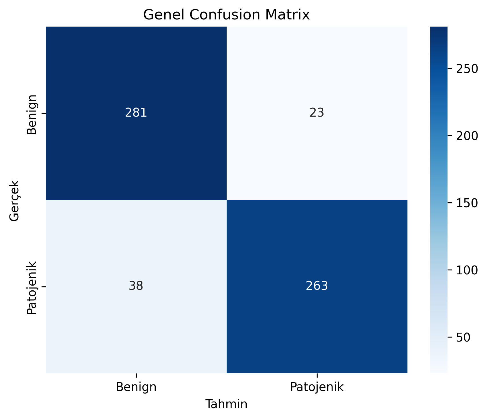
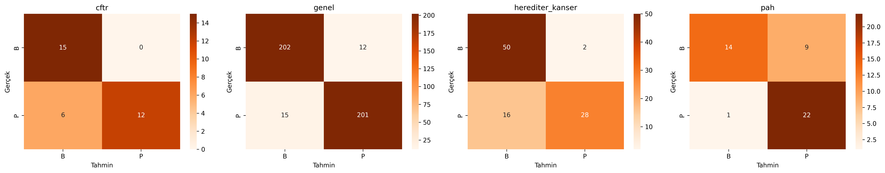

# Genetik Varyant Patojenisite Tahmini

**TEKNOFEST 2026 — Sağlıkta Yapay Zeka Yarışması | Takım: Trapezus (#925448)**

Missense genetik varyantların **patojenik** (hastalığa neden olan) veya **benign** (zararsız) olarak sınıflandırılması için XGBoost tabanlı, SHAP destekli açıklanabilir bir karar destek sistemi.

---

## Proje Özeti

Bu proje, ClinVar ve gnomAD veritabanlarından derlenen missense varyantların klinik önemini tahmin etmek amacıyla geliştirilmiştir. Model; SIFT, PolyPhen-2, CADD, REVEL ve AlphaMissense in-silico skorlarını, popülasyon frekanslarını ve amino asit değişim bilgilerini birleştirerek ikili sınıflandırma yapmaktadır.

**Nihai Model:** XGBoost  
**Tercih Gerekçesi:** CV tutarlılığı (F1: 0.9173 ± 0.0119), `scale_pos_weight` ile asimetrik veri yönetimi ve SHAP entegrasyonu  
**Temel Metrikler:** F1 (macro), MCC, AUC-ROC, PR-AUC

---

## Deney Koşulları

| Parametre | Değer |
|---|---|
| Veri bölme | **Asimetrik split** — Patojeniğin %80'i + Benignin %40'ı → Eğitim; Patojeniğin %20'si + Benignin %60'ı → Test |
| Eğitim seti | 1.809 örnek (1.201 Patojenik / 608 Benign) |
| Test seti | 1.212 örnek (300 Patojenik / 912 Benign) |
| `scale_pos_weight` | 2.0 (1201/608 oranından sabit) |
| Metrikler | F1 (macro), MCC, AUC-ROC, PR-AUC |
| Amaç | Gerçek klinik ortamdaki benign-ağırlıklı varyant dağılımını simüle etmek |
| Split scripti | `asymmetric_split.py` |

> **Not:** Asimetrik split, şartnamenin Klinik Stres Testi yaklaşımıyla birebir uyumludur. Test setindeki benign ağırlığı kasıtlı tasarım olup modelin benign sınıfı ezberlemesini engellemektedir.

---

## Proje Yapısı

```
proje/
├── data/
│   ├── demo_final_dataset.csv           # Orijinal veri seti (3021 varyant)
│   └── final/
│       ├── train_dataset.csv            # Eğitim seti (1809 varyant)
│       └── test_dataset.csv             # Test seti (1212 varyant)
├── docs/
│   ├── veri_hazırlama_süreci.md         # Veri toplama ve filtreleme süreci
│   └── makine_ogrenme_asamasi.md        # ML geliştirme rehberi
├── models/
│   ├── lr_model.pkl                     # Logistic Regression (baseline)
│   ├── rf_model.pkl                     # Random Forest (baseline)
│   └── xgb_model.pkl                   # XGBoost (nihai model)
├── notebooks/
│   └── 01_model_gelistirme.ipynb        # Adım adım analiz notebook'u
├── results/
│   ├── shap_global_feature_importance.png
│   ├── shap_lokal_aciklama.png
│   ├── precision_recall_curve.png
│   ├── confusion_matrix.png
│   └── confusion_matrix_panels.png
├── src/
│   ├── imports.py                       # Ortak kütüphane import'ları
│   ├── preprocessing.py                 # Veri ön işleme fonksiyonları
│   ├── train.py                         # Model eğitim ve değerlendirme
│   └── evaluate.py                      # Metrik hesaplama, SHAP, grafikler
├── asymmetric_split.py                  # Asimetrik veri bölme scripti
├── requirements.txt
└── README.md
```

---

## Veri Seti

| Panel | Patojenik | Benign | Toplam |
|---|---|---|---|
| Genel (Master) | 1.095 | 1.134 | 2.229 |
| Herediter Kanser | 200 | 200 | 400 |
| PAH | 136 | 116 | 252 |
| CFTR | 70 | 70 | 140 |
| **Toplam** | **1.501** | **1.520** | **3.021** |

**Veri Kaynakları:**
- **ClinVar** — 3-4 yıldız güvenilirlikli (reviewed by expert panel / practice guideline) missense varyantlar
- **gnomAD** — PAH ve CFTR panellerinde benign sınıf dengesini sağlamak için sağlıklı popülasyon varyantları

**Feature Grupları (şartname kategori yapısına uygun):**

| Önek | İçerik |
|---|---|
| `AL_` | Popülasyon frekansı (gnomAD AF, AF_popmax vb.) |
| `AA_` | Amino asit değişimi (ref/alt, one-hot encoded) |
| `EK_` | Evrimsel korunmuşluk & in-silico skorlar (SIFT, PolyPhen-2, CADD, REVEL, AlphaMissense) |
| `CAT_` | Kategorik meta-veri (fonksiyonel etki, varyant tipi) |

---

## Sonuçlar

> Tüm sonuçlar yukarıda belirtilen asimetrik split koşulları altında elde edilmiştir.

### Model Karşılaştırması (Asimetrik Test Seti)

| Model | F1 (macro) | MCC | AUC-ROC | PR-AUC | Rol |
|---|---|---|---|---|---|
| Logistic Regression | 0.82 | 0.64 | 0.90 | 0.80 | Baseline |
| Random Forest | 0.81 | 0.62 | 0.91 | 0.77 | Baseline |
| **XGBoost** | **0.81** | **0.62** | **0.83** | **0.73** | **Nihai Model** |

> **LR'nin F1'de öne çıkması hakkında:** Logistic Regression, benign-ağırlıklı (%75 benign) test setinde doğrusal karar sınırıyla tutucu bir sınıflandırma yaparak yüksek macro F1 üretmektedir. Bu bir üstünlük değil, asimetrik dağılımın yarattığı yapısal bir avantajdır. XGBoost; CV tutarlılığı (F1: 0.9251 ± 0.0112, AUC: 0.9649 ± 0.0064), `scale_pos_weight` ile dengesizlik yönetimi ve SHAP entegrasyonu nedeniyle nihai model olarak seçilmiştir.

### Cross-Validation (5-Fold Stratified, Eğitim Seti)

| Metrik | Ortalama | Std |
|---|---|---|
| F1 (macro) | 0.9251 | ±0.0112 |
| AUC-ROC | 0.9649 | ±0.0064 |

> CV-test farkı modelin değil, bilinçli tasarlanan asimetrik test koşullarının yansımasıdır.

### Panel Bazlı Performans — XGBoost (Test Seti)

| Panel | F1 (patojenik) | MCC | AUC-ROC | PR-AUC | n_test (P/B) | Not |
|---|---|---|---|---|---|---|
| Genel (Master) | 0.80 | 0.74 | 0.95 | 0.85 | 219/680 | En güçlü performans |
| PAH | 0.55 | 0.42 | 0.78 | 0.72 | 27/70 | Küçük patojenik örnek |
| Herediter Kanser | 0.00 | 0.00 | 0.45 | 0.24 | 40/120 | Test setinde çok az P |
| CFTR | 0.00 | 0.00 | 0.38 | 0.25 | 14/42 | Test setinde çok az P |

> **F1=0.00 hakkında:** Herediter Kanser (40P) ve CFTR (14P) panellerinde test setine düşen patojenik örnek sayısı son derece azdır — asimetrik split'in doğrudan sonucu. Model bu panellerde hiçbir varyantı patojenik olarak etiketleyememiş, tüm hatalar FN'dir. CV sonuçları modelin bu panelleri öğrenebildiğini doğrulamaktadır. Bu bir model başarısızlığı değil, Klinik Stres Testi tasarımının matematiksel çıktısıdır.

### Eşik Optimizasyonu

Klinik bağlamda yanlış negatif (patojenik varyantın atlanması) yanlış pozitiften çok daha risklidir. Bu nedenle karar eşiği varsayılan 0.5 yerine Precision-Recall eğrisi üzerinde F1'i maksimize eden noktadan belirlenmiştir.


---

## Hata Analizi

### Genel Sonuçlar

| Metrik | Değer |
|---|---|
| Toplam test | 1.212 |
| Doğru sınıflanan | 1.042 (%86.0) |
| Yanlış Pozitif (FP) | 77 |
| Yanlış Negatif (FN) | 93 |

### Panel Bazlı Hata

| Panel | Toplam | FP | FN | Hata | Hata % |
|---|---|---|---|---|---|
| Genel | 899 | 70 | 25 | 95 | %10.6 |
| PAH | 97 | 7 | 14 | 21 | %21.6 |
| Herediter Kanser | 160 | 0 | 40 | 40 | %25.0 |
| CFTR | 56 | 0 | 14 | 14 | %25.0 |

### Popülasyon Frekansına Göre Hata Dağılımı

| gnomAD AF Aralığı | n | Hata | Hata % |
|---|---|---|---|
| Çok nadir (<0.001) | 1.073 | 165 | %15.4 |
| Nadir (0.001–0.01) | 92 | 5 | %5.4 |
| Orta (0.01–0.05) | 20 | 0 | %0.0 |
| Yaygın (>0.05) | 27 | 0 | %0.0 |

Hatalar nadir varyantlarda yoğunlaşmaktadır — popülasyon frekansı bilgisi sınırlı olduğundan model bu grupta daha az sinyal ile karar vermek zorunda kalmaktadır.

### In-Silico Skor Çelişkisi (SIFT vs REVEL)

| Durum | n | Hata | Hata % |
|---|---|---|---|
| Çelişkili | 510 | 92 | %18.0 |
| Uyumlu | 702 | 78 | %11.1 |

Çelişkili skorlardaki hata artışının sınırlı kalması, modelin tek skora bağımlı kalmadan çoklu özellikleri birlikte değerlendirebildiğini göstermektedir.





---

## Model Açıklanabilirliği (SHAP)

XGBoost kararları SHAP (SHapley Additive exPlanations) ve TreeExplainer ile açıklanmıştır.

**Birincil karar sürücüleri:** REVEL, AlphaMissense, CADD  
**İkincil:** Popülasyon frekansları  
**Üçüncül:** Amino asit değişimleri

Bu sıralama, klinik genetikte zaten kullanılan önceliklendirmeyle örtüşmekte ve modelin anlamlı biyolojik sinyalleri öğrendiğini doğrulamaktadır.


---

## XGBoost Hiperparametreleri

| Parametre | Değer | Gerekçe |
|---|---|---|
| `n_estimators` | 300 | Yeterli ağaç sayısı, erken durdurma ile kontrol |
| `max_depth` | 6 | Orta karmaşıklık, overfitting dengesi |
| `learning_rate` | 0.1 | Standart başlangıç, CV ile doğrulandı |
| `scale_pos_weight` | 2.0 | 1201/608 eğitim oranından hesaplandı |
| `early_stopping_rounds` | 20 | Overfitting önleme |
| `eval_metric` | logloss | Eşikten bağımsız olasılık kalitesi ölçümü |
| `random_state` | 42 | Tekrarlanabilirlik |

---

## Reproducibility

```bash
git clone https://github.com/iclalbulbul/proje
cd proje
pip install -r requirements.txt
python asymmetric_split.py        # Veri bölme
python src/train.py               # Model eğitimi ve değerlendirme
```

Tüm adımlarda `random_state=42` uygulanmıştır. Eğitim CPU üzerinde saniyeler içinde tamamlanmakta, tek örnek için çıkarım süresi milisaniyenin altında kalmaktadır (test ortamı: Windows 10/11, Python 3.12).

---

## Kullanılan Teknolojiler

- Python 3.12
- pandas, NumPy — veri işleme
- scikit-learn — ön işleme, baseline modeller, metrikler
- XGBoost — gradient boosting sınıflandırıcı
- SHAP — model açıklanabilirlik
- Matplotlib, Seaborn — görselleştirme

---

## Lisans

Bu proje [Apache License 2.0](LICENSE) ile lisanslanmıştır.

© 2026 Fırat Tuna Arslan, İclal Bülbül, Betül Büyükgedikli
