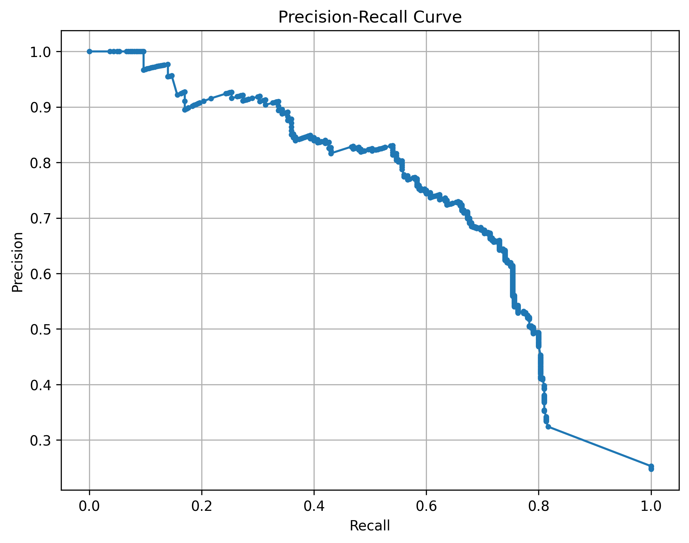
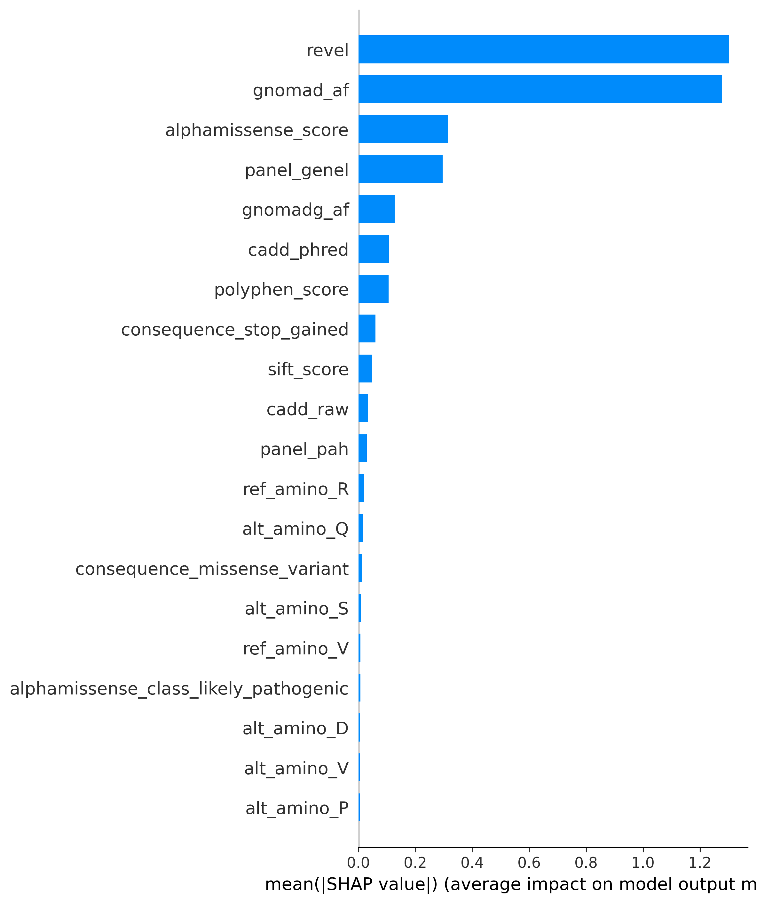
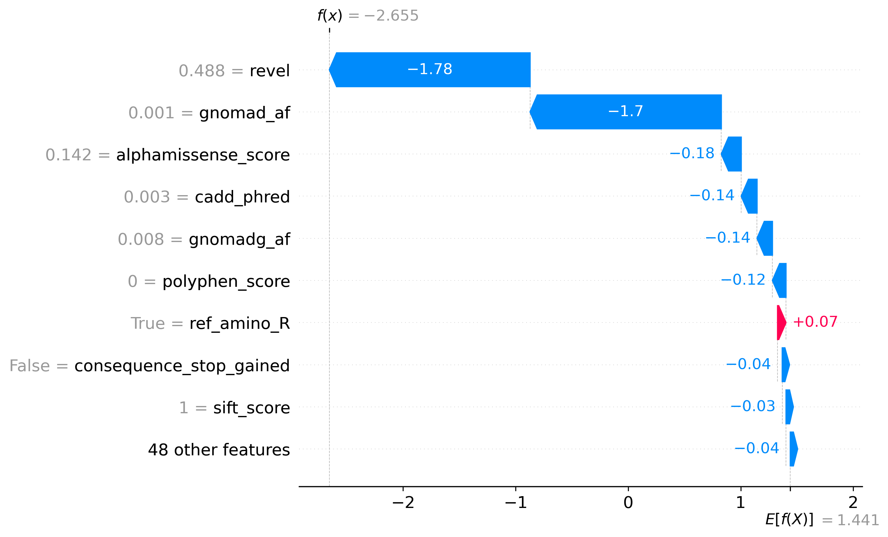

# Genetik Varyant Patojenisite Tahmini

**TEKNOFEST 2026 — Sağlıkta Yapay Zeka Yarışması**

Genetik varyantların **patojenik** (hastalığa neden olan) veya **benign** (zararsız) olup olmadığını makine öğrenmesi ile tahmin eden bir sınıflandırma sistemi.

---

## Proje Özeti

Bu proje, ClinVar ve gnomAD veritabanlarından derlenen missense varyantların klinik önemini tahmin etmek amacıyla geliştirilmiştir. Model, varyantlara ait in silico tahmin skorları (SIFT, PolyPhen-2, CADD, REVEL, AlphaMissense), popülasyon frekansları ve protein değişim bilgilerini kullanarak ikili sınıflandırma yapmaktadır.

**Temel Metrik:** F1 Skoru  
**En İyi Model:** XGBoost — F1: 0.90, AUC-ROC: 0.96

---

## Proje Yapısı

```
proje/
├── data/
│   └── demo_final_dataset.csv       # Eğitim veri seti (3021 varyant)
├── docs/
│   ├── veri_hazırlama_süreci.md     # Veri toplama ve filtreleme süreci
│   └── makine_ogrenme_asamasi.md    # ML geliştirme rehberi
├── models/
│   ├── lr_model.pkl                 # Logistic Regression (baseline)
│   ├── rf_model.pkl                 # Random Forest (baseline)
│   └── xgb_model.pkl               # XGBoost (asıl model)
├── notebooks/
│   └── 01_model_gelistirme.ipynb    # Adım adım analiz notebook'u
├── results/
│   ├── shap_global_feature_importance.png
│   ├── shap_lokal_aciklama.png
│   └── precision_recall_curve.png
├── src/
│   ├── imports.py                   # Ortak kütüphane import'ları
│   ├── preprocessing.py             # Veri ön işleme fonksiyonları
│   ├── train.py                     # Model eğitim ve değerlendirme
│   └── evaluate.py                  # Metrik hesaplama, SHAP, grafikler
├── requirements.txt
└── README.md
```

---

## Veri Seti

| Panel | Patojenik | Benign | Toplam |
|-------|-----------|--------|--------|
| Genel | 1095 | 1134 | 2229 |
| Herediter Kanser | 200 | 200 | 400 |
| PAH | 136 | 116 | 252 |
| CFTR | 70 | 70 | 140 |
| **Toplam** | **1501** | **1520** | **3021** |

**Veri Kaynakları:**
- **ClinVar** — 3-4 yıldız güvenilirlikli missense varyantlar
- **gnomAD** — PAH ve CFTR panelleri için benign varyant takviyesi

**Feature'lar:** SIFT, PolyPhen-2, CADD, REVEL, AlphaMissense, gnomAD frekansları, amino asit değişimi, fonksiyonel etki

---

## Sonuçlar

### Model Karşılaştırması

| Model | F1 (macro) | AUC-ROC |
|-------|-----------|---------|
| Logistic Regression | 0.84 | 0.92 |
| Random Forest | 0.89 | 0.95 |
| **XGBoost** | **0.90** | **0.96** |

### Panel Bazlı Performans (XGBoost)

| Panel | F1 (patojenik) | AUC-ROC | Not |
|-------|---------------|---------|-----|
| Genel | 0.94 | 0.98 | En güçlü performans |
| PAH | 0.81 | 0.94 | Küçük veri seti |
| Herediter Kanser | 0.76 | 0.87 | En zorlu panel |
| CFTR | 0.80 | 0.92 | Küçük veri seti |

### Cross-Validation (5-Fold)

- **F1:** 0.8988 ± 0.0107
- **AUC:** 0.9688 ± 0.0035

### Eşik Optimizasyonu

Klinik bağlamda yanlış negatif (hasta varyantın atlanması) yanlış pozitiften daha riskli olduğundan, varsayılan 0.5 eşiği yerine **0.41** eşiği seçilerek recall 0.87'den **0.90'a** yükseltilmiştir.

<p align="center">
  
</p>
<p align="center"><em>Precision-Recall eğrisi — farklı eşik değerlerinde precision ve recall dengesi</em></p>

---

## Model Açıklanabilirliği (SHAP)

XGBoost modelinin kararlarını anlamak için SHAP (SHapley Additive exPlanations) analizi kullanılmıştır.

### Global Feature Importance

Tüm veri seti üzerinde hangi özelliklerin model kararlarına en çok katkı sağladığını gösterir:

<p align="center">
  
</p>
<p align="center"><em>SHAP global özellik önem sıralaması — REVEL, AlphaMissense ve CADD en etkili özellikler</em></p>

### Lokal Açıklama (Tek Varyant)

Tek bir varyant için modelin tahmin gerekçesini gösteren waterfall grafiği:

<p align="center">
  
</p>
<p align="center"><em>SHAP waterfall — bireysel bir varyantın patojenisite tahmininin açıklaması</em></p>

---

## Kurulum ve Çalıştırma

```bash
# Sanal ortam oluştur
python -m venv .venv
.venv\Scripts\activate       # Windows

# Bağımlılıkları kur
pip install -r requirements.txt

# Modeli eğit ve değerlendir
cd src
python train.py
```

---

## Yöntem

1. **Veri Ön İşleme** — SIFT/PolyPhen string skorlarından sayısal değer çıkarma, eksik değerlerin median ile doldurulması, kategorik değişkenlerin one-hot encoding ile dönüştürülmesi
2. **Baseline Modeller** — Logistic Regression ve Random Forest ile referans noktası belirleme
3. **XGBoost** — `scale_pos_weight` ile sınıf dengesizliği yönetimi, `early_stopping` ile overfitting önleme
4. **Açıklanabilirlik** — SHAP analizi ile global feature importance ve lokal açıklamalar
5. **Kalibrasyon** — Precision-Recall eğrisi ile klinik bağlama uygun eşik seçimi
6. **Doğrulama** — 5-fold stratified cross-validation ile tutarlılık kontrolü

---

## Kullanılan Teknolojiler

- Python 3.12
- pandas, NumPy — veri işleme
- scikit-learn — ön işleme, baseline modeller, metrikler
- XGBoost — gradient boosting sınıflandırıcı
- SHAP — model açıklanabilirlik
- Matplotlib, Seaborn — görselleştirme

---

## Lisans

Bu proje [Apache License 2.0](LICENSE) ile lisanslanmıştır.

© 2026 Fırat Tuna Arslan, İclal Bülbül, Betül Büyükgedikli